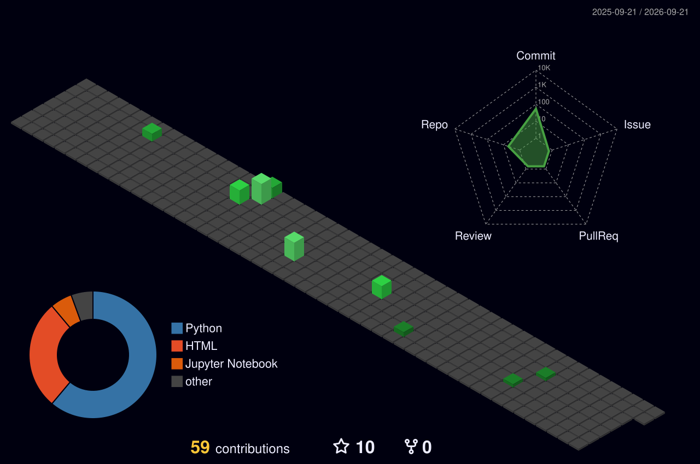

<h1 align="center" style="font-size: 42px;">
  Hey there!  I'm 
  <b style="color: #007ACC;">Rahul Patil</b>
</h1>

<h3 align="center" style="font-size: 24px;">
  Software Developer 💻 | AI Enthusiast 🤖 | IoT Innovator 🌐 | Full-Stack Craftsman 🛠️
</h3>

  

---

## 🌟 About Me

> 🚀 Energetic and curious problem solver with a unique blend of **Biomedical Engineering** and **Computer Science**, passionate about turning ideas into impactful real-world solutions.

- 🧠 Innovating at the **intersection of health, data, and code**.
- ⚡ Skilled in full-stack web dev, AI/ML, IoT systems & cloud architectures.
- 📈 Lifelong learner with a mission to **build smart, human-centered products**.
- 💬 Open to tech talks, collaborative projects, or tackling tough DSA challenges!

---

## 🚀 Current Highlights

- 🧪 **Data Science Intern @ ResoluteAI Software** — Built customer segmentation models, reduced MSE by **15%**.
- 🧵 **Community Manager Intern @ NBLINK** — Managed virtual events & boosted social media engagement.
- 🏥 **IoT-Based Health Monitoring System** — Presented at academic symposiums & featured in research.
- ✨ **Open Source Contributor** — Contributions to TensorFlow, Scikit-learn, and other major libraries.

---

## 🎓 Education

- 🎓 **PG-DAC (Post Graduate Diploma in Advanced Computing)** — CDAC Kharghar, Navi Mumbai (2025)
- 🎓 **B.E. in Biomedical Engineering (Honors in Data Science)** — Vidyalankar Institute of Technology, Mumbai (2020–2024) — **CGPA: 8.62**

---

## 🗂️ Publications

- 📄 **NutriFLEX.AI** — *International Journal of Scientific Research in Engineering and Management (IJSREM)*, October 2024  
  - An AI-powered nutrition platform with personalized meal planning, mood tracking, and gamified wellness insights.

---

## 💻 Tech Stack & Skills

  

| 💡 Domain | ⚙️ Tools & Frameworks |
|-----------|-----------------------|
| **Languages** | Python, C++, JavaScript, SQL |
| **Frontend** | React.js, HTML5, CSS3, Bootstrap, Quill.js |
| **Backend** | Flask, Node.js, Express |
| **AI/ML** | TensorFlow, Scikit-learn, Streamlit |
| **Cloud/DevOps** | Docker, GitHub Actions, ThingSpeak |
| **Concepts & Others** | JWT Auth, DSA, OOP, MVC, REST APIs, Firebase |

---

## 🛠️ Featured Projects

| Project | Description | Tech |
|---------|--------------|------|
| 🥗 [NutriFLEX.AI](https://github.com/rahulpatil-tech/NUTRIFLEX) | AI-based nutrition assistant with mood detection & gamified tracking | Streamlit, OpenAI API, TensorFlow |
| 📖 [Blog Platform](https://github.com/RahulPatil-Tech/Good_thoughts/tree/Master) | Role-based blogging app with JWT auth & WYSIWYG editor | Flask, SQLAlchemy, MySQL |
| 📟 [Advance-Patient_Monitoring_System](https://github.com/RahulPatil-Tech/Advance-Patient_Monitoring_System) | Real-time vitals tracking synced to the cloud | Python, ESP32, MAX30102, ThingSpeak |
| 🧬 [Uterine_Corpus_Predictor](https://github.com/RahulPatil-Tech/Uterine_Corpus) | Random Forest model predicting survival status for Uterine Corpus Endometrial Carcinoma | Scikit-learn, Pandas, Matplotlib, Seaborn |
| 🏨 [City_Explorer](https://github.com/RahulPatil-Tech/City_Explorer) | Modern React interface for hotel listings with filters & responsive design | React, JSX, CSS |
| 🌱 [ESP32 Smart Plant Watering System](https://github.com/RahulPatil-Tech/ESP32-Smart-Watering) | Automatic plant watering system with RTC + NTP time sync, TM1637 display, and relay-controlled pump | ESP32, MicroPython, DS3231, TM1637, IoT |

---

## 🏅 Certifications & Achievements

- 🥇 **AI Innovation Challenge 2024 Finalist** — NutriFLEX.AI 🧠🥗
- 📄 **Published Research Paper** — *NutriFLEX.AI*, IJSREM (Oct 2024)
- 🏆 **Kaggle Medals** — 1× Silver, 11× Bronze  
  - Competitions: Jane Street RMF (Silver), Decoding the Heart: Advanced ML (Bronze), NBA Prediction & Analysis (Bronze)
  - **Notebooks Expert** rank: 1,326 of 56,783 (Highest: 1,313)
- 🛠️ **Open Source Contributor** — TensorFlow, Scikit-learn
- 🧩 **HackerRank Certifications** — Python (Gold), SQL (Silver), Problem Solving (Bronze)
- 🏅 **Best IoT Project Presenter** — TechX Symposium 2023

---

## 🧠 DSA & Competitive Programming

| Platform | Badge | Highlights |
|----------|-------|------------|
| **LeetCode** |  | Python 🥉, SQL 🥈 |
| **HackerRank** |  | Gold, Silver, Bronze |

---

## 👨‍💼 Leadership & Impact

- 🛠️ **Head of Technical Support**, BMESI-VIT Mumbai  
  - Led 10+ workshops and hackathons on AI, IoT, and Full-Stack Dev.
  - Coordinated multi-team event logistics and technical operations.
- 🎙️ **Speaker & Mentor**  
  - Presented projects at intercollegiate symposiums.
  - Mentored 50+ students in ML, IoT, and Full-Stack best practices.
- ✍️ **Tech Blogger (Coming Soon)**  
  - Authoring deep-dive tutorials and project stories on GitHub & LinkedIn.

---

## 📈 Activities & Continuous Learning

- 📊 Leading community engagement through tech events and virtual meetups.
- 🧩 Constantly sharpening DSA and problem-solving skills.
- 📚 Exploring MLOps, scalable system design, and hardware-software integration.

---

## 🎯 Goals for 2025

- 🚀 Master MLOps pipelines and advanced system design.
- 🔑 Solve 500+ LeetCode problems.
- 🤝 Contribute to 10+ impactful open-source projects.
- 🎤 Speak at a national-level tech conference.
- ✍️ Publish technical blogs and tutorials to empower fellow devs.

---
## 📊 GitHub Stats:

  

  

## 📬 Let’s Connect & Collaborate!

📍 **Dombivli, Mumbai, India**  
📞 **+91 8291216667**  
📧 **rp3252154@gmail.com**

  
  
  
  
  

---

  

  

  ✨ *Let’s innovate, inspire, and impact lives through technology.* 🚀

