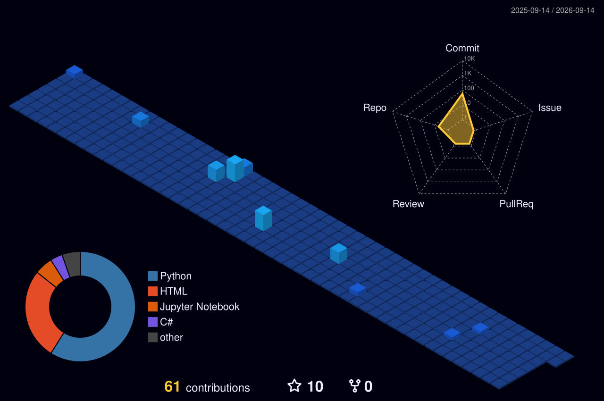

<h1 align="center">🚀 Hi 👋, I'm Rahul Patil</h1> <h3 align="center">AI & Analytics Enthusiast | Innovator | Problem Solver</h3> 
 
  

---

## 🌟 About Me
- 🔬 Passionate about **AI-powered health tech** & **predictive analytics**  
- 🚀 Building **NUTRIFLEX**, a smart AI-driven nutrition assistant  
- 💡 Exploring **LSTM, XGBoost, Deep Learning & Cloud Computing**  
- 🎯 Interested in **AI-driven investment strategies** & **gamified leadership**  
- 💬 Ask me about **AI, analytics, health tech & MLOps**  

---

## 🚀 Featured Projects
### 🔹 [Emotion-Detector-Stress-Relief-Suggestions](https://github.com/rahulpatil-tech/Emotion-Detector-Stress-Relief-Suggestions) *(Public Template)*
🧠 AI-powered emotion detection with personalized well-being recommendations.  

### 🔹 [NUTRIFLEX](https://github.com/rahulpatil-tech/NUTRIFLEX) *(Public)*
🥗 Making personalized nutrition **accessible & engaging** for everyone.  

### 🔹 [CodeClauseInternship_URL_Shorteners](https://github.com/rahulpatil-tech/CodeClauseInternship_URL_Shorteners) *(Public)*
🔗 Simple yet powerful URL shortener using Python, SQLite & MD5 hashing.  

### 🔹 [To-do-list](https://github.com/rahulpatil-tech/To-do-list) *(Public)*
📝 Python-based **to-do list** with a clean & intuitive UI for task management.  

📌 **More projects on my GitHub!** 🚀  

---

## 🌐 Connect With Me  

  
  
  
  
  

---

## 🛠️ Tech Stack & Tools

  
  
  
  
  
  
  
  

---

## 🏆 Competitive Programming

  

### 🎖️ LeetCode Achievements
- 🥈 **Silver Badge:** SQL  
- 🥉 **Bronze Badge:** Python  

### 🎖️ HackerRank Achievements
- 🥇 **Gold Badge:** Python  
- 🥈 **Silver Badge:** SQL  
- 🥉 **Bronze Badge:** Problem Solving  

### 📜 Certifications
- ✅ **Python (Basic & Intermediate)**  
- ✅ **SQL (Basic & Intermediate)**  
- ✅ **Problem Solving (Basic & Intermediate)**  

---

## 🏅 Certifications & Achievements

<table align="center">
  <tr>
    <td>🏆</td>
    <td><strong>AI Innovation Challenge Finalist</strong></td>
  </tr>
  <tr>
    <td>📜</td>
    <td><strong>Published Research</strong> on AI in Personalized Healthcare</td>
  </tr>
  <tr>
    <td>💻</td>
    <td><strong>Open Source Contributor</strong> in <code>TensorFlow</code> & <code>Scikit-learn</code></td>
  </tr>
  <tr>
    <td>🚀</td>
    <td>Built multiple AI/ML projects with real-world impact</td>
  </tr>
  <tr>
    <td>🧪</td>
    <td>Contributed to medical tech innovations</td>
  </tr>
</table>

---

## 📊 GitHub Summary

  
  
   

---

## 🌱 Current Interests
- 🤖 **AI in Healthcare & Personalized Nutrition**  
- 📊 **Deep Learning & Advanced Analytics**  
- ☁️ **Cloud Computing & MLOps**  

📌 **Always open to collaborations & AI-driven projects!** 🚀  

